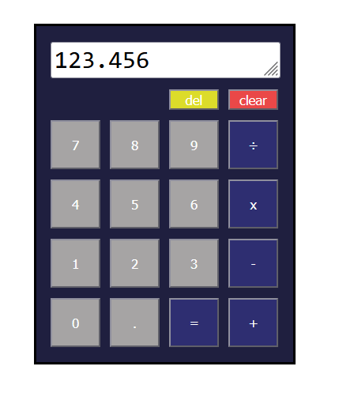

# Basic Arithmetic Calculator

A simple, responsive calculator built with **HTML**, **CSS**, and **JavaScript**.  
Supports basic arithmetic operations: addition, subtraction, multiplication, and division.

---

## 🚀 Features

- **Basic arithmetic**: +, −, ×, ÷  
- **Decimal support**  
- **Chaining operations** (e.g., `5 + 3 × 2`)  
- **Clear/reset functionality**  
- Simple, user-friendly interface  
- Built entirely with vanilla HTML, CSS, and JS — no frameworks

---

## 📸 Preview

  

